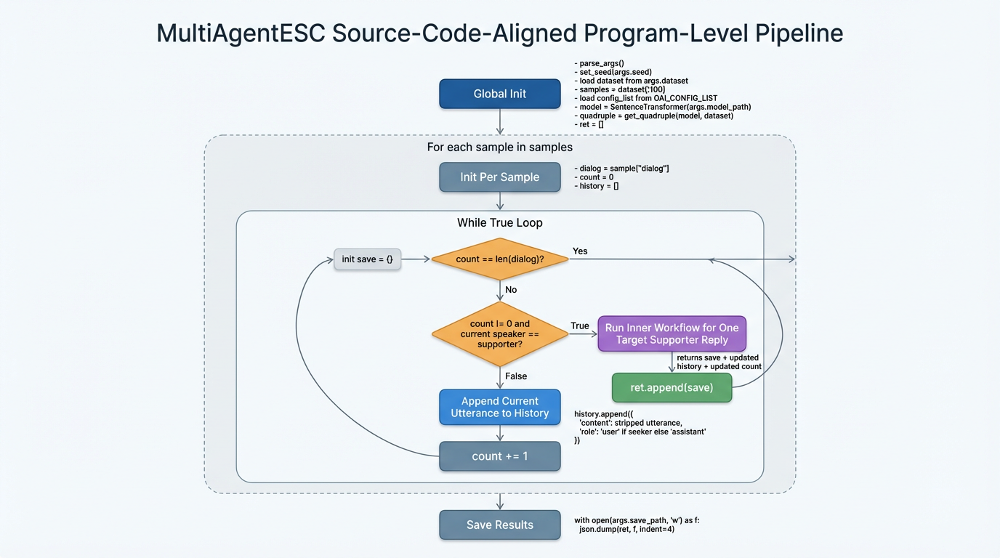
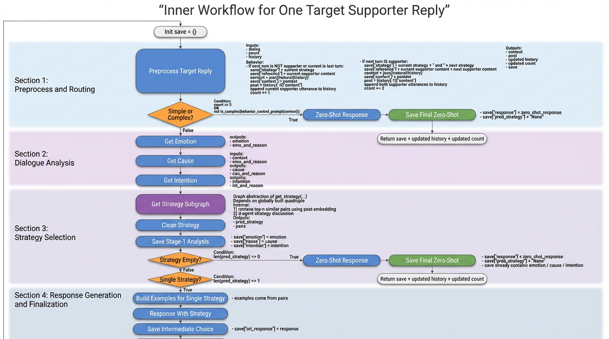

# 在masfactory上复现mutilagentesc

## 项目背景：

实验室实习任务

## 项目目标：

在masfactory上复现mutilagentesc

## 项目状态：

pr已合入masfactory官方main仓库：https://github.com/BUPT-GAMMA/MASFactory/tree/main/applications/multiagentesc

## 复现经过：

### 1.通过看论文知道它是在干嘛：

通过设计mutil-agent流程来使情感回答质量尽可能好

### 2.通过看源码抽象出流程图来：

外层大Loop：

```text
每个循环维护一个save={}
一条条对话扫过去 if speaker=="seeker":
                    count++
                    更新attribute(全图共享的状态库，里面有很多属性)中的history
            else if speaker=="supporter":
                    回复=内层子图(history)
```

内层子图：

```text
if count<=5 or is_not_complex:
    zero_shot response
else:
    get emotion
    get cause
    get intention
    从[100:]检索出top-k的最相似的两句对话准备后面喂给模型作为参考
    3-Agent discussion出策略：
        if len(pred_strategy)==0:
            fall back to zero_shot response
        else if len(pred_strategy)==1:
            就用这个策略回答就行了
            self-reflection自己检测下看看有没有什么问题
        else if len(pred_strategy)>1:
            debate吵一架
            reflect看看别人说的有没有道理，可以反悔
            开始投票
            if 有一个得票最多的策略:
                那就用这个策略了
                self-reflection
            else:
                让一个Agent来judge一下
                self-reflection
        return 回复
```

<br />
<br />
<br />





### 3.写代码

纯自己手写的demo版：MutilAgentESC_test01

路径：`static/code/AgentProject/mutilagentesc/MutilAgentESC_test01/`

完全体：MutilAgentESC_test02

路径：`static/code/AgentProject/mutilagentesc/MutilAgentESC_test02/`

### 4.运行main.py得到results.json

### 5.运行eval.py得到7个性能指标

### 6.效果

我的代码跑了3个测试用例，拿源码跑了1个，性能差不多

ps:我的代码为什么不多跑一些？

代码跑起来太慢了，时间几乎都在等LLM响应，用的qwen，跑一个测试用例1块钱

ps:源码为什么不多跑一些？

源码用的autoGen，跑多了在多agent讨论的时候会爆显存

### 7.bad case分析

1. is_not_complex判断不准，老是觉得不复杂直接走Zero-shot
2. 3-agent讨论出来的策略不准，老是要用多个策略，实际上一个策略就可以了
3. 大模型选策略的时候老是偏好去共情别人
